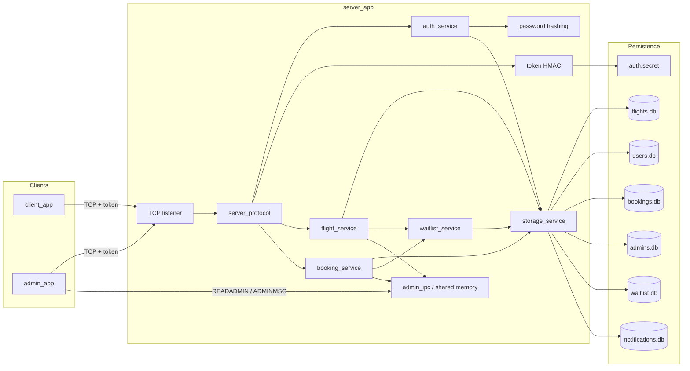
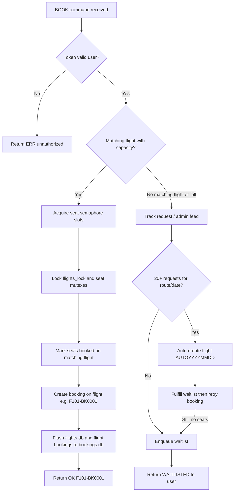

# Flight Booking System

A CLI-based flight booking system written in C. Three programs work together over TCP sockets while the server coordinates concurrent bookings with mutexes, semaphores, shared memory, and file-backed storage.


| Program      | Role                                                                          |
| ------------ | ----------------------------------------------------------------------------- |
| `server_app` | Owns shared state, handles socket requests, persists data                     |
| `client_app` | User CLI: signup/login (HMAC token + waitlist notices), lookup, book, cancel, history |
| `admin_app`  | Admin CLI for managing flights, admins, and the shared admin feed             |


An HTTP/JSON API for a future HTML frontend lives in [`web/api/`](web/api/README.md) (`python3 web/api/gateway.py` or `make api`). It proxies to `server_app` and does not replace the CLI clients. The design notes are in [`API_PLAN.md`](API_PLAN.md).

## Requirements

- A C compiler (`gcc` or `clang`)
- `make`
- A Unix-like environment with POSIX threads, shared memory, and sockets

## Build

From the project root:

```sh
make
```

This produces `server_app`, `client_app`, and `admin_app`.

To remove build artifacts, local database files, and `auth.secret`:

```sh
make clean
```

## Run

Start the server first:

```sh
./server_app
```

The default port is `9090`. A custom port can be supplied:

```sh
./server_app 9091
```

Run user and admin clients from separate terminals:

```sh
./client_app 127.0.0.1 9090
./admin_app 127.0.0.1 9090
```

Host and port can be passed as arguments:

```sh
./client_app <host> <port>
./admin_app <host> <port>
```

If the server has no persisted admin user, it creates a default admin on startup:

```text
Admin ID: admin
Password: admin123
```

## Project Workflow: Start to Finish

This section walks through the full lifecycle of the system: building it, starting it, running admin and user clients, handling bookings (including edge cases), and shutting down with persistence.

### Overview

Three programs cooperate over TCP. The server owns all shared state; clients send one-line text commands and receive text responses. Persistence is handled by the embedded `my_dbms` B-tree engine.




### Step 1: Build the project

From the project root:

```sh
make
```

This compiles:

- `server_app` — server binary, linked with the `my_dbms` storage engine
- `client_app` — user CLI
- `admin_app` — admin CLI

To reset build artifacts, local database files, and the HMAC signing secret:

```sh
make clean
```

Run `make clean` before your first run after upgrading, or whenever you want a fresh database. Old `.db` files from a previous storage format are not compatible with the current my_dbms-backed layout. Deleting `auth.secret` invalidates any previously issued tokens.

### Step 2: Start the server

Open a terminal and start the server first. All clients depend on it.

```sh
./server_app          # listens on port 9090
./server_app 9091     # custom port
```

When `server_app` starts, it performs the following initialization sequence:

1. **Allocate server state** — zeroes in-memory arrays for flights (each with its own bookings array), users, admins, flight requests, waitlist entries, and login notifications.
2. **Initialize mutexes** — sets up `state_lock`, `flights_lock`, `requests_lock`, and `waitlist_lock`.
3. **Load or create the auth secret** — 32 random bytes in `auth.secret`, used to HMAC-sign tokens. Reusing the same file keeps tokens valid across restarts.
4. **Load persistence** — `storage/storage_service.c` opens or creates six database files (`flights.db`, `users.db`, `bookings.db`, `admins.db`, `waitlist.db`, `notifications.db`) through the my_dbms adapter in `storage/db_handler.c`. Only records that were previously saved are loaded back; empty slots stay empty. Legacy flat `bookings.db` files are migrated automatically into the per-flight layout on load.
5. **Rebuild runtime sync objects** — for each loaded flight, mutexes, seat mutexes, and the seat-counting semaphore are recreated (these are not stored on disk).
6. **Ensure a default admin exists** — if no admin with a stored password hash is found in `admins.db`, the server creates `admin` / `admin123` (the password is hashed before it is written).
7. **Create the admin feed** — opens POSIX shared memory `/flight_admin_bus` (4096 bytes) for admin notifications and cross-admin messaging.
8. **Start the TCP listener** — binds to the chosen port and spawns a detached thread per incoming client connection.

The server prints:

```text
Server listening on port 9090
```

Leave this terminal running for the entire session.

### Step 3: Connect the admin client

Open a second terminal and start the admin CLI:

```sh
./admin_app 127.0.0.1 9090
```

The admin app verifies the server is reachable (via a `PING` command), then shows an authentication menu:

1. **Admin Login** — enter `admin` / `admin123` on first run (or your own credentials after creating admins). The server returns an admin token; later menu actions send that token instead of the password.
2. After login, the admin menu provides:
  - Create another admin user
  - Create a flight (flight number, source, destination, date, seat count, price)
  - Change a flight date
  - Update a flight price
  - List all flights
  - List all admins
  - Write a message to the shared admin feed
  - Read the shared admin feed

Each menu choice is translated by `client/client.c` into a socket command that includes the admin token from login (for example, `ADMIN_CREATE_FLIGHT <token> F101 BLR DEL 1 5 2026 20 4500`) and sent to the server.

**Typical first-time admin setup:**

1. Log in as `admin` / `admin123`.
2. Choose **Create Flight** and enter route details, for example:
  - Flight number: `F101`
  - Source: `BLR`, Destination: `DEL`
  - Date: `1 5 2026` (day month year)
  - Seats: `20`, Price: `4500`
3. The server stores the flight in memory, initializes seat mutexes and the seat semaphore, and flushes the record to `flights.db`.

Flights must exist before users can book them, unless demand triggers automatic creation (see Step 7).

### Step 4: Connect the user client

Open a third terminal and start the user CLI:

```sh
./client_app 127.0.0.1 9090
```

The user app also pings the server, then shows an authentication menu:

1. **Signup** — register a new user ID and password. The server hashes the password, issues a user token, and the CLI treats the user as logged in.
2. **Login** — authenticate with existing credentials and receive a user token (plus any waitlist notices).

After login, the user menu provides:

- List flights for a source and destination
- View details for a specific flight number
- Book seats (source, destination, date, seat count) — full flights enqueue the user on a waitlist
- View current bookings
- Cancel a booking by booking ID
- Receive waitlist booking notices on the next login

### Step 5: User signup and login

**Signup flow:**

1. User selects Signup and enters an ID and password.
2. `client_app` sends `SIGNUP <user> <password>` to the server.
3. The server locks `state_lock`, checks for duplicate IDs, allocates a user slot, hashes the password with a random salt (SHA-256), and writes the record to `users.db`. Only the `sha256$<salt>$<hash>` string is stored — never the plaintext password.
4. Server responds `OK <token>`. The client stores the token in memory and treats the user as logged in.

**Login flow:**

1. User selects Login and enters credentials.
2. `client_app` sends `LOGIN <user> <password>`.
3. The server looks up the user, verifies the password against the stored salted SHA-256 hash, and returns `OK <token>`.
4. If the user was booked from the waitlist while offline, the response includes `NOTIFICATIONS:` lines after the token. The client prints them after login.

Authentication is **stateless**. The server does not keep a session table. `LOGIN` / `SIGNUP` / `ADMIN_LOGIN` return an HMAC-signed token (`role.subject.expiry.mac`). Every later command must include that token; the server verifies the signature, expiry (24 hours), and role. The client stores the token in memory until logout. Example: `BOOK <token> BLR DEL 1 5 2026 2`.

### Step 6: Search and book a flight (happy path)

Once logged in, a typical booking proceeds as follows:

1. **List flights** — user enters source and destination (for example, `BLR` and `DEL`). The server returns all matching flights with date, available seats, and price.
2. **Book seats** — user enters source, destination, date (`day month year`), and seat count.
3. The server runs the booking pipeline:




1. On success, the server returns a flight-scoped booking ID such as `OK F101-BK0001`.
2. The user can choose **View My Bookings** to confirm the reservation.

Each flight owns its own bookings array (`flight->bookings[]`). The booking record stores the user ID, flight number, seat count, and allocated seat numbers.

### Step 7: When no flight is available (waitlist)

If the user requests a route and date that has no flight, or all matching flights are full, the server does not fail silently. Instead:

1. **Tracks the request** — increments a counter for that source, destination, and date combination (used for automatic flight creation).
2. **Publishes to the admin feed** — writes a message to shared memory `/flight_admin_bus`, for example:
  ```text
   Flight creation requested by user alice: BLR->DEL on 01/05/2026, seats requested:2, suggested capacity:12, reason:all matching flights are full or do not have enough seats
  ```
3. **Enqueues a waitlist entry** — FIFO by sequence number, keyed by user plus source and destination. The client shows that the flight is full and the user is on the waitlist.

**How the waitlist is fulfilled:**

When an admin (or auto-create) adds a new flight with the same source and destination, `fulfill_waitlist_for_flight` books queued users onto that flight in queue order, as long as enough seats remain. Each fulfilled user gets a persisted notification. On the user's next `LOGIN`, the response is `OK <token>` followed by `NOTIFICATIONS:` lines (flight number, route, date, booking ID, seats).

**Two ways extra capacity appears:**


| Path                  | Trigger                                  | What happens                                                                                                                                                                                   |
| --------------------- | ---------------------------------------- | ---------------------------------------------------------------------------------------------------------------------------------------------------------------------------------------------- |
| Manual admin creation | Any number of requests                   | Admin reads the feed (menu option 8) and creates a flight on that route. Waitlisted users are booked automatically; they see a notice at next login.                                           |
| Automatic creation    | 20 users request the same route and date | Server auto-creates flight `AUTO<YYYYMMDD>`, fulfills the waitlist, sets remaining capacity from requested seats + 10 (max 25), price 0, and notifies the admin feed.                          |


Only one auto-created flight is generated per route/date combination. Admins can update the price later via **Update Flight Price**.

### Step 8: Cancel a booking

From the user client, select **Cancel Booking** and enter the booking ID (for example, `F101-BK0001`). The CLI sends `CANCEL <token> <booking_id>`.

The server:

1. Validates the user token.
2. Finds the booking by ID and checks that it belongs to the token subject.
3. Clears the in-memory booking slot on that flight.
4. Releases each seat under its seat mutex.
5. Posts back to the flight semaphore for every released seat.
6. Deletes the booking from `bookings.db` and flushes updated seat state to `flights.db`.

The seat becomes available for other users immediately.

### Step 9: Admin monitoring and coordination

Admins use the shared-memory feed throughout the session:

- **Read feed** (menu option 8 or `READADMIN <token>`) — see flight creation requests, auto-creation notifications, and messages from other admins.
- **Write message** (menu option 7 or `ADMINMSG <token> <message>`) — broadcast notes to other admin sessions.

Example auto-creation notification in the feed:

```text
Auto-created flight AUTO20260501 for BLR->DEL on 01/05/2026 (capacity:12). Pending users may now book.
```

Admin actions such as creating flights, changing dates, and updating prices are also logged to the feed and persisted to `flights.db` or `admins.db` as appropriate.

### Step 10: Concurrent operation

Multiple user and admin clients can connect at the same time. The server handles each connection in its own thread (`server/server_main.c`).

Synchronization layers prevent data races:

- `flights_lock` protects the flights array, per-flight booking slot allocation, and booking lookups.
- Each seat has its own mutex for seat state.
- A counting semaphore per flight tracks available seats and blocks booking when full.
- File locks and a DB API mutex protect my_dbms reads and writes.

This means two users can book different flights in parallel, while seat conflicts on the same flight are serialized safely.

### Step 11: Shut down the server

Stop the server with `Ctrl+C` or `SIGTERM`. The signal handler calls `server_shutdown`, which:

1. Flushes in-use flights, admins, users, and bookings to disk through my_dbms (waitlist and notification records are already written on each change).
2. Unmaps and unlinks the shared-memory admin feed.
3. Destroys flight mutexes, seat mutexes, and semaphores.
4. Destroys the global server mutexes.

Database files remain in the directory where the server was started. Starting the server from a different directory creates or uses a separate set of `.db` files.

### Step 12: Restart and recover state

To resume after shutdown:

1. Start `server_app` again in the same directory.
2. The server reloads all persisted records from the six `.db` files (including waitlist queue and unread login notifications).
3. Flight mutexes and semaphores are rebuilt from saved seat occupancy.
4. Start `client_app` and `admin_app` — existing users, flights, and bookings are available immediately. Clients must log in again to obtain a new token (or reuse a token that is still within 24 hours if `auth.secret` was not deleted).

**Quick verification after restart** (replace tokens from a fresh `LOGIN` / `ADMIN_LOGIN`):

```sh
printf 'LOGIN alice secret\n' | nc 127.0.0.1 9090
# OK u.alice.<exp>.<hmac>
printf 'MYBOOKINGS <user-token>\n' | nc 127.0.0.1 9090
printf 'LIST <user-token> BLR DEL\n' | nc 127.0.0.1 9090
```

### Complete first-session checklist

Use this as a practical run-through for a fresh install:


| Step | Terminal   | Action                                               |
| ---- | ---------- | ---------------------------------------------------- |
| 1    | Any        | `make`                                               |
| 2    | Terminal 1 | `./server_app`                                       |
| 3    | Terminal 2 | `./admin_app 127.0.0.1 9090` → login → create flight |
| 4    | Terminal 3 | `./client_app 127.0.0.1 9090` → signup → login       |
| 5    | Terminal 3 | List flights → book seats → view bookings            |
| 6    | Terminal 2 | Read admin feed to monitor requests                  |
| 7    | Terminal 3 | Cancel booking (optional)                            |
| 8    | Terminal 1 | `Ctrl+C` to shut down and persist                    |
| 9    | Terminal 1 | Restart `./server_app` and confirm data survived     |


### Raw protocol alternative

The CLI menus in `client_app` and `admin_app` are wrappers around the text protocol. You can drive the same workflow directly with tools like `nc`:

```sh
printf 'SIGNUP alice secret\n' | nc 127.0.0.1 9090
# OK u.alice.<exp>.<hmac>
TOKEN=...  # copy the token from the LOGIN/SIGNUP response
printf 'ADMIN_LOGIN admin admin123\n' | nc 127.0.0.1 9090
# OK a.admin.<exp>.<hmac>
printf 'ADMIN_CREATE_FLIGHT <admin-token> F101 BLR DEL 1 5 2026 20 4500\n' | nc 127.0.0.1 9090
printf 'LIST <user-token> BLR DEL\n' | nc 127.0.0.1 9090
printf 'BOOK <user-token> BLR DEL 1 5 2026 2\n' | nc 127.0.0.1 9090
# Full flights return WAITLISTED; a later ADMIN_CREATE_FLIGHT on the same route books waitlisted users.
```

See **Communication Model** below for the full command reference.

## User Workflow

Users interact through `client_app`.

Available actions:

- Signup and login
- List flights for a source and destination
- View details for a flight number
- Book seats for a source, destination, date, and seat count (waitlisted if the flight is full)
- View current bookings
- Cancel a booking by booking ID
- See waitlist booking confirmations on login

When a booking succeeds, the server returns a flight-scoped booking ID such as `F101-BK0001` (`<flight_number>-BK<seq>`). The booking record is stored in that flight's `bookings[]` array and includes the user ID, flight number, seat count, and allocated seat numbers.

## Admin Workflow

Admins interact through `admin_app`.

Available actions:

- Login as an admin (stores an HMAC token; the password is not sent again)
- Create another admin user
- Create a flight with flight number, route, date, seat count, and price
- Change a flight date
- Update a flight price
- List all flights
- List all admins
- Write to the shared-memory admin feed
- Read the shared-memory admin feed

Admins are responsible for creating flights on demand. Users cannot create flights directly.

## Password Storage

User and admin passwords are never stored in plaintext. On signup or admin create, the server:

1. Draws 16 random salt bytes from `/dev/urandom`.
2. Computes SHA-256 over `salt || password`.
3. Persists a single string: `sha256$<salt hex>$<hash hex>` in `users.db` or `admins.db`.

Login recomputes the hash with the stored salt and compares in constant time. The TCP protocol still sends the password on `SIGNUP`/`LOGIN` (plain text over the socket); hashing protects the database files, not the network.

Existing `users.db` / `admins.db` files from before this change are incompatible. Run `make clean` before restarting so new hashed records are created. The default admin remains `admin` / `admin123` after a clean start.

## Stateless Auth Tokens

After a successful `LOGIN`, `SIGNUP`, or `ADMIN_LOGIN`, the server returns `OK <token>`. The token is HMAC-SHA256 over `role.subject.unix_expiry` using a 32-byte secret stored in `auth.secret` (created on first start). The server does not keep a session table.

- User tokens (`u....`) are required for `LIST`, `DETAIL`, `BOOK`, `CANCEL`, and `MYBOOKINGS`.
- Admin tokens (`a....`) are required for all `ADMIN_*` mutation/list commands plus `ADMINMSG` and `READADMIN`.
- `PING`, `SIGNUP`, `LOGIN`, and `ADMIN_LOGIN` stay public.
- Tokens expire after 24 hours (`AUTH_TOKEN_TTL_SEC`). Client logout only drops the local copy.

`CANCEL` also checks that the booking belongs to the token subject.

## Booking Data Model

Bookings live on each flight, not in a top-level server array:

- In memory: `Flight.bookings[MAX_BOOKINGS_PER_FLIGHT]` with a per-flight `next_booking_slot` cursor.
- On disk: `bookings.db` keys partition slots by flight index (see **Persistence** below).
- IDs: `<flight_number>-BK<seq>` (for example, `F101-BK0001`).

Listing or cancelling a user's booking scans all flights and their per-flight booking arrays. Legacy flat `bookings.db` files are migrated on server startup.

## Booking Behavior

When a user books seats, the server:

1. Validates the user token and takes the user ID from it.
2. Searches for a matching flight by source, destination, day, month, and year.
3. Checks the flight semaphore to confirm enough seats are available.
4. Locks the selected flight while seats are allocated.
5. Locks individual seat mutexes before marking seats as booked.
6. Stores the booking and flushes updated flight and booking data to disk.

If no matching flight exists, or if all matching flights are full, the server tracks the request **and** enqueues the user on the waitlist (see **Waitlist** below). When 20 or more users request the same route and date combination, the system automatically creates a flight (see **Automatic Flight Creation** below). Otherwise:

1. Publishes a flight creation request to the admin feed.
2. Returns `WAITLISTED` to the user client.
3. Books the user automatically when a new flight on that source/destination is created.

The admin feed message includes the requesting user, route, date, requested seats, suggested capacity, and the reason for the request.

Example admin feed message:

```text
Flight creation requested by user user1: BLR->DEL on 01/05/2026, seats requested:2, suggested capacity:12, reason:no matching flight exists
```

## Automatic Flight Creation

To reduce dependency on manual admin intervention, the system automatically creates flights when demand is high enough.

**How it works:**

- The server tracks user requests for flights that do not exist.
- When 20 users have requested the same route and date combination, a flight is automatically created.
- The auto-created flight is assigned a unique flight number: `AUTO<YYYYMMDD>` (e.g., `AUTO20260501`).
- The flight capacity is set to the requested seats plus a 10-seat buffer, capped at 25 seats per flight.
- The flight price is initially set to 0; admins can update it later.
- The user whose request triggered the auto-creation immediately proceeds with booking if the newly created flight still has sufficient capacity after waitlist fulfillment.
- Other waitlisted users on that source/destination are booked onto the new flight in queue order (no retry required).
- Admins are notified via the admin feed that a flight was auto-created.

**Configuration:**

- Threshold for automatic creation: `20` users (`AUTO_CREATE_FLIGHT_THRESHOLD` in `server/server_state.h`)
- Maximum tracked requests: `10000` (`MAX_FLIGHT_REQUESTS` in `server/server_state.h`)

**Note:** Only one flight is auto-created per route/date combination, even if more than 20 requests accumulate. If a flight already exists for that route and date (even if full), no duplicate is auto-created. Subsequent requests use the existing flight or join the waitlist.

## Waitlist

When a booking cannot be completed because matching flights are full (or none exist), the user is placed on a FIFO waitlist instead of being asked to retry later.

**How it works:**

- `BOOK` that cannot allocate seats returns `WAITLISTED`. The client tells the user they will be booked when a new flight on the same route is created.
- Each entry stores user ID, source, destination, requested date, and seat count. Queue order is a monotonic sequence number. A user has at most one entry per source/destination; a later request on the same route updates seats and date.
- Creating a flight (admin or auto-create) scans the waitlist for matching source and destination, then books queued users onto that flight in order while seats remain.
- Each successful waitlist booking writes a notification record. The next `LOGIN` for that user returns `OK <token>` plus `NOTIFICATIONS:` lines (flight number, route, date, booking ID, seats). The client prints them under **Notifications**.
- Waitlist and unread notifications are persisted in `waitlist.db` and `notifications.db`.

**Limits:** `MAX_WAITLIST` and `MAX_NOTIFICATIONS` are both `10000` (see `server/server_state.h`).

## Cancellation Behavior

When a user cancels a booking, the server:

1. Validates the user token.
2. Finds the booking by booking ID and confirms it belongs to that user.
3. Clears the booking record.
4. Finds the booked flight.
5. Unlocks each seat from the booking under its seat mutex.
6. Posts back to the flight semaphore for every released seat.
7. Flushes the updated flight and booking data.

##  Concurrency Model

The server uses several layers of synchronization:

- `state_lock` protects admin/user authentication state.
- `flights_lock` protects the flights array during flight searches, creation, and per-flight booking slot allocation.
- `requests_lock` protects flight-request tracking for auto-creation.
- `waitlist_lock` protects the waitlist queue and login notification array.
- Each seat has a `seat_mutex` to protect individual seat state.
- Each flight has a counting semaphore initialized to the number of available seats.
- Database files are protected with `fcntl` file locks during reads and writes.
- A process-wide DB API mutex protects the shared my_dbms handler state.

This architecture enables concurrent bookings: multiple clients can book different flights in parallel. Seat conflicts on the same flight are prevented by `flights_lock` during slot allocation and by per-seat mutexes during seat assignment.

## Communication Model

User and admin clients communicate with the server over TCP sockets. Each request is a single line of text; the server returns a text response.

Supported commands:


| Command                                                                                         | Description                                      |
| ----------------------------------------------------------------------------------------------- | ------------------------------------------------ |
| `PING`                                                                                              | Health check; returns `ONLINE` (no token)        |
| `SIGNUP <user> <password>`                                                                      | Register a user; returns `OK <token>`            |
| `LOGIN <user> <password>`                                                                       | Authenticate a user; returns `OK <token>` plus waitlist notices |
| `LIST <token> <source> <destination>`                                                           | List flights on a route                          |
| `DETAIL <token> <flight_number>`                                                                | Show details for one flight                      |
| `BOOK <token> <source> <destination> <day> <month> <year> <seats>`                              | Book seats (full flights go to the waitlist)     |
| `CANCEL <token> <booking_id>`                                                                   | Cancel own booking                               |
| `MYBOOKINGS <token>`                                                                            | List the token owner's bookings                  |
| `ADMIN_LOGIN <admin> <password>`                                                                | Authenticate an admin; returns `OK <token>`      |
| `ADMIN_CREATE <token> <new_admin> <new_pw>`                                                     | Create an admin                                  |
| `ADMIN_CREATE_FLIGHT <token> <flight> <source> <dest> <day> <month> <year> <seats> <price>`     | Create a flight                                  |
| `ADMIN_CHANGE_TIMING <token> <flight> <day> <month> <year>`                                     | Change flight date                               |
| `ADMIN_UPDATE_PRICE <token> <flight> <price>`                                                   | Update flight price                              |
| `ADMIN_LIST_FLIGHTS <token>`                                                                    | List all flights                                 |
| `ADMIN_LIST_ADMINS <token>`                                                                     | List all admins                                  |
| `ADMINMSG <token> <message>`                                                                    | Publish a message to the admin feed              |
| `READADMIN <token>`                                                                             | Read the shared admin feed                       |


The CLI programs in `client/client.c` wrap these commands so users and admins can work through menus instead of typing protocol messages manually.

### Example protocol session

```sh
# Start the server, then from another terminal:
printf 'SIGNUP alice secret\n' | nc 127.0.0.1 9090
# OK u.alice.<exp>.<hmac>

printf 'ADMIN_LOGIN admin admin123\n' | nc 127.0.0.1 9090
# OK a.admin.<exp>.<hmac>

printf 'ADMIN_CREATE_FLIGHT <admin-token> F101 BLR DEL 1 5 2026 20 4500\n' | nc 127.0.0.1 9090
# OK

printf 'LIST <user-token> BLR DEL\n' | nc 127.0.0.1 9090
# Flights:
# F101 date:01/05/2026 seats:20/20 price:4500.00

printf 'BOOK <user-token> BLR DEL 1 5 2026 2\n' | nc 127.0.0.1 9090
# OK F101-BK0001

# If the flight is full, the same BOOK command returns:
# WAITLISTED flight full; you will be booked when a new flight on this route is created

# After an admin creates another BLR->DEL flight, alice's next login includes:
# OK <token>
# NOTIFICATIONS:
# Waitlist booking confirmed: F102 BLR->DEL date:02/05/2026 booking:F102-BK0001 seats:2
```

## Shared-Memory Admin Feed

The admin feed is backed by POSIX shared memory named `/flight_admin_bus` (4096 bytes).

It is used for:

- Admin-to-admin messages
- Admin change logs, such as flight creation or price updates
- User-triggered flight creation requests when booking cannot proceed
- Notifications when a flight is auto-created

Admins can read this feed from the admin app (menu option 8) or via the `READADMIN <token>` socket command.

Example auto-creation notification:

```text
Auto-created flight AUTO20260501 for BLR->DEL on 01/05/2026 (capacity:12). Pending users may now book.
```

## Persistence

The server persists data through the B-tree engine in `my_dbms/`. `storage/storage_service.c` maps each domain table to a separate database file and uses the my_dbms C API (`create`, `get`, `update`, `delete`, `db_open_with_value_size`, `db_close`) via a thin adapter in `storage/db_handler.c`.


| File                | Contents                          |
| ------------------- | --------------------------------- |
| `flights.db`        | Flight records and seat occupancy |
| `admins.db`         | Admin accounts (salted password hashes) |
| `users.db`          | User accounts (salted password hashes) |
| `bookings.db`       | Per-flight booking records        |
| `waitlist.db`       | FIFO waitlist entries             |
| `notifications.db`  | Unread login notices for waitlist bookings |
| `auth.secret`       | 32-byte HMAC key for auth tokens (not a my_dbms table) |


Each file is a my_dbms table keyed by slot index (`uint32_t`). Records are fixed-size structs that match the in-memory server state. On startup, missing database files are created and initialized. Existing files are loaded back into memory. Runtime-only synchronization objects such as mutexes and semaphores are rebuilt after persisted flight records are loaded.

**Key layout:**

| File                | Key                         | Record                         |
| ------------------- | --------------------------- | ------------------------------ |
| `flights.db`        | Flight slot index           | `FlightPersist` (seats, route) |
| `users.db`          | User slot index             | `UserEntry`                    |
| `admins.db`         | Admin slot index            | `AdminEntry`                   |
| `bookings.db`       | `flight_index * MAX_BOOKINGS_PER_FLIGHT + booking_index` | `BookingRecord` |
| `waitlist.db`       | Waitlist slot index         | `WaitlistEntry`                |
| `notifications.db`  | Notification slot index     | `UserNotification`             |

Bookings are not stored in a single global array. Each flight has up to `MAX_BOOKINGS_PER_FLIGHT` slots in memory and in `bookings.db`. Booking IDs are flight-scoped (`F101-BK0001`), and `storage_flush_flight_bookings()` writes only the bookings for one flight after a book or cancel.

Starting the server from a different directory creates or uses a different set of database files.

**Note:** Database files use the my_dbms page format, not the older fixed-record layout. Run `make clean` before restarting if you have leftover `.db` files from a previous version. `make clean` also removes `auth.secret`.

## Concurrency Tests

An integration test suite verifies that simultaneous bookings do not overbook seats and that different flights can be booked in parallel. Each case uses hard-coded protocol commands, expected OK/reject counts, and post-condition `DETAIL` checks.

```sh
make test-concurrency
```

This builds `concurrent_booking_test`, starts an isolated server on port `19090`, runs seven barrier-synchronized race scenarios, and prints per-thread inputs/outputs. The harness logs in, caches HMAC tokens, and rewrites `BOOK` / `DETAIL` / `ADMIN_CREATE_FLIGHT` to the token protocol before sending. Full case documentation is in [`tests/TEST_CASES.md`](tests/TEST_CASES.md).

| Test | Scenario | Expected |
| ---- | -------- | -------- |
| 01 | 10 clients, 1 seat each, 5-seat flight | 5 OK, 5 reject, `seats:0/5` |
| 02 | 5 clients × 2 different flights | 10 OK, both flights full |
| 03 | 5 clients × 2 seats on 10-seat flight | 5 OK, `seats:0/10` |
| 04 | 10 clients × 2 seats on 10-seat flight | 5 OK, 5 reject |
| 05 | 8 clients, 1-seat flight | 1 OK, 7 reject |
| 06 | Parallel bookings on two flights | `CF107-BK0001` and `CF108-BK0001` |
| 07 | 50 clients on 25-seat flight | 25 OK, 25 reject, `seats:0/25` |

Under contention, rejected bookings may return `ERR booking failed`, `REQUESTED flight unavailable`, or `WAITLISTED`; all count as failures. The seat-count verification is the overbooking guard.

## Important Limits

The main limits are defined in `server/server_state.h` and `server/token.h`:


| Constant                       | Value      |
| ------------------------------ | ---------- |
| `MAX_FLIGHTS`                  | 1000       |
| `MAX_SEATS_PER_FLIGHT`         | 25         |
| `MAX_USERS`                    | 10000      |
| `MAX_BOOKINGS_PER_FLIGHT`      | 1000       |
| `MAX_ADMINS`                   | 128        |
| `MAX_FLIGHT_REQUESTS`          | 10000      |
| `MAX_WAITLIST`                 | 10000      |
| `MAX_NOTIFICATIONS`            | 10000      |
| `PASSWORD_HASH_SIZE`           | 128        |
| `AUTH_TOKEN_SIZE`              | 192        |
| `AUTH_TOKEN_TTL_SEC`           | 86400 (24h)|
| `AUTH_SECRET_LEN`              | 32 bytes   |
| `ADMIN_SHM_SIZE`               | 4096 bytes |
| `AUTO_CREATE_FLIGHT_THRESHOLD` | 20 users   |


## Project Structure

Source code is grouped by role. The Makefile adds `-Iserver`, `-Iclient`, and `-Istorage` so modules can include headers by name (for example, `#include "server_state.h"`).

```text
redux/
├── Makefile
├── README.md
├── apps/                     # Program entry points
│   ├── server_app.c          # Server main
│   ├── client_app.c          # User CLI main
│   └── admin_app.c           # Admin CLI main
├── server/                   # Server core, protocol, and services
│   ├── server.h              # Server umbrella header
│   ├── server_state.c/h      # Shared state and lifecycle
│   ├── server_main.c/h       # TCP listener and thread dispatch
│   ├── server_protocol.c/h   # Socket command handlers
│   ├── auth_service.c/h      # User signup and login
│   ├── password.c/h          # Salted SHA-256 password hashing
│   ├── token.c/h             # HMAC auth tokens
│   ├── flight_service.c/h    # Flight CRUD and request tracking
│   ├── booking_service.c/h   # Booking and cancellation
│   ├── waitlist_service.c/h  # Full-flight queue and login notices
│   └── admin_ipc.c/h         # Shared-memory admin feed
├── client/                   # Shared client library for both CLIs
│   ├── client.c
│   └── client.h
├── storage/                  # Persistence layer
│   ├── storage_service.c/h   # Domain-to-disk mapping
│   └── db_handler.c/h        # Adapter over my_dbms C API
└── my_dbms/                  # B-tree DBMS engine
    ├── Makefile
    ├── README.md
    └── src/
        ├── api/                # Public CRUD API
        ├── app/                # Standalone DBMS shell
        ├── btree/              # B-tree page layout and algorithms
        ├── shell/              # REPL helpers
        ├── sql/                # Demo SQL parser and executor
        └── storage/            # Pager, table, cursor, row
```

Build artifacts (`server_app`, `client_app`, `admin_app`) and runtime files (`*.db`, `auth.secret`) are written to the project root.